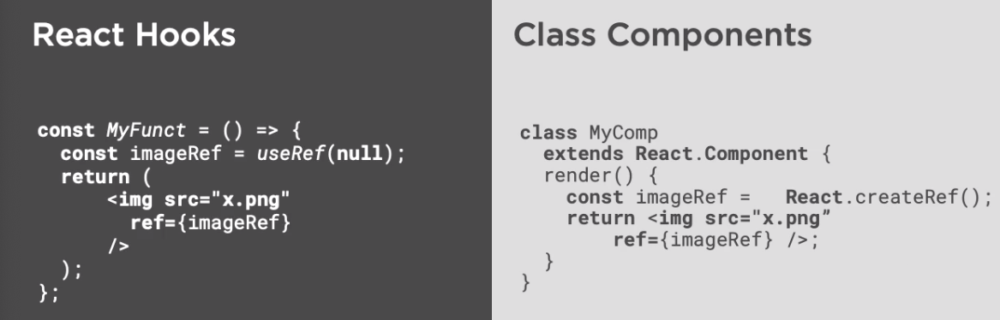

<!-- START doctoc generated TOC please keep comment here to allow auto update -->
<!-- DON'T EDIT THIS SECTION, INSTEAD RE-RUN doctoc TO UPDATE -->
**Table of Contents**  *generated with [DocToc](https://github.com/thlorenz/doctoc)*

- [Using React Hooks](#using-react-hooks)
  - [Intro](#intro)
    - [Hooks will cover in this course](#hooks-will-cover-in-this-course)
    - [Setup](#setup)
    - [First Hook: setState](#first-hook-setstate)
    - [useRef](#useref)
    - [useEffect Hook](#useeffect-hook)
    - [useEffect, useRef and useState for Colorizing on Scroll](#useeffect-useref-and-usestate-for-colorizing-on-scroll)
  - [Using More Hooks](#using-more-hooks)
    - [Basic Usage and Rules](#basic-usage-and-rules)
    - [Setup fully featured project](#setup-fully-featured-project)
    - [Preparing React Context for Use with useContext Hook](#preparing-react-context-for-use-with-usecontext-hook)
    - [useContext to Access Global Configuration from React Context API](#usecontext-to-access-global-configuration-from-react-context-api)
    - [useReducer Is What useState Is Built On](#usereducer-is-what-usestate-is-built-on)
    - [Using useReducer with Multiple Dispatched Actions](#using-usereducer-with-multiple-dispatched-actions)
    - [Using useCallback to improve React App Performance](#using-usecallback-to-improve-react-app-performance)
    - [Using useMemo to Optimize Filtering and Sorting Speakers](#using-usememo-to-optimize-filtering-and-sorting-speakers)
  - [Migrating Existing Apps to React Hooks](#migrating-existing-apps-to-react-hooks)
    - [Differences and Similarities](#differences-and-similarities)
    - [Tracking State Changes in React Hooks Functional Components vs. React Class Components](#tracking-state-changes-in-react-hooks-functional-components-vs-react-class-components)
    - [What useState Represents in a Class Component](#what-usestate-represents-in-a-class-component)
    - [What useRef Represents in a Class Component](#what-useref-represents-in-a-class-component)
    - [What useEffect Represents in a Class Component](#what-useeffect-represents-in-a-class-component)
  - [Learn How to combine Existing React Hooks into Custom Hooks](#learn-how-to-combine-existing-react-hooks-into-custom-hooks)
    - [Why Custom Hooks](#why-custom-hooks)
    - [Demo: Time out and Email Validation](#demo-time-out-and-email-validation)
    - [Combining Multiple React Hooks into One Custom Hook](#combining-multiple-react-hooks-into-one-custom-hook)
    - [Introducing the Custom Hook useAxiosfetch for async REST](#introducing-the-custom-hook-useaxiosfetch-for-async-rest)
    - [Integrating custom Hook useAxiosFetch in Conference App](#integrating-custom-hook-useaxiosfetch-in-conference-app)
    - [Updating Speaker Favorite with useAxiosFetch Custom Hook](#updating-speaker-favorite-with-useaxiosfetch-custom-hook)
  - [Integrating Authentication](#integrating-authentication)
    - [What is Authentication in a Web App](#what-is-authentication-in-a-web-app)
    - [Updating Conference Site as if Login Was Done](#updating-conference-site-as-if-login-was-done)
    - [Customizing Node Server for Authentication](#customizing-node-server-for-authentication)

<!-- END doctoc generated TOC please keep comment here to allow auto update -->

# Using React Hooks

> My notes from Pluralsight [course](https://www.pluralsight.com/courses/using-react-hooks)

## Intro

### Hooks will cover in this course

* useState - manage component state (actually built on top of useReducer with default action)
* useRef - access to DOM element
* useEffect - side effects to run when component mounts/unmounts and/or re-renders
* useContext - config that needs to be shared across entire app without HOC or prop drilling
* useReducer - take in previous state and action to return new state
* useCallback - memoize (aka cache) functions
* useMemo - momoize (aka cahce) values

[Course Repo](https://github.com/pkellner/pluralsight-course-using-react-hooks)

### Setup

Using Next.js

```shell
take hello-next
npm init -y
npm i --save react reactdom next
mkdir pages
```

Add to `package.json`, `scripts` section:

```json
"dev": "next",
"build": "next build",
"start": "next start",
```

Start by adding a new js file to `pages` dir. Name of file becomes route to that page. eg, `index.js` will be root.

```jsx
// hello-next/pages/index.js
import React from 'react';

const InputElement = () => {
  return <input placeholder="Enter Some Text" />;
};

export default InputElement;
```

To run app:

```shell
npm run dev
```

Navigate to [http://localhost:3000/](http://localhost:3000/)

### First Hook: setState

All hooks run in functional components, start with `use...`, used for tracking state and interfacing with react lifecycle events.

Hook into `onChange` event of input field (fired on every keystroke).

`useState` hook is named export in react library, import with `{useState}`.

Recommended: `useState` should track a single object or value. In this example, will track the string value that is typed into input field.

Value passed to `useState` is the initial value.

`useState` hook returns an array, use destructuring to assign them to variables. First value in this array is a read-only variable whose value can only be set with the second value in this array, which is always a function. This function will update state, and this state value is reflected in the read-only variable.

```jsx
// hello-next/pages/index.js
import React, { useState } from 'react';

const InputElement = () => {
  const [inputText, setInputText] = useState('');
  return (
    <div>
      <input
        onChange={e => {
          setInputText(e.target.value);
        }}
        placeholder="Enter Some Text"
      />
      You typed: {inputText}
    </div>
  );
};

export default InputElement;
```

Enhancement: Add another state value to track history of all changes to input field. Initialize this as empty array. Notice the single `onChange` method is now making multiple useState calls, this is the recommended way:

```jsx
// hello-next/pages/index.js
import React, { useState } from 'react';

const InputElement = () => {
  const [inputText, setInputText] = useState('');
  const [historyList, setHistoryList] = useState([]);

  return (
    <div>
      <input
        onChange={e => {
          setInputText(e.target.value);
          setHistoryList([...historyList, e.target.value]);
        }}
        placeholder="Enter Some Text"
      />
      You typed: {inputText}
      <br />
      <h3>Change History</h3>
      <ul>
        {historyList.map(rec => {
          return <li>{rec}</li>;
        })}
      </ul>
    </div>
  );
};

export default InputElement;
```

### useRef

Common react hooks include:
- useState
- useRef
- useEffect

`useRef` - allow access directly to an element in the DOM. Generally shouldn't directly manipulate DOM but sometimes is necessary.

eg: display black and white image, which changes to color on mouseover.

For static images, place in `/static` dir and will be available to all pages.

Components go in `/src` dir.

```jsx
// PAGE: hello-next/pages/image-change-on-mouse-over.js
import React from 'react';
import ImageToggleOnMouseOver from '../src/image-toggle-on-mouse-over';

const ImageChangeOnMouseOver = () => {
  return (
    <div>
      <ImageToggleOnMouseOver
        primaryImg="/static/bw/cristiane-teston-2iV9nqP4Y6A-unsplash.jpg"
        secondaryImg="/static/color/marco-chilese-Cn-mhBXzR_I-unsplash.jpg"
        alt=""
        width="300px"
      />
      &nbsp;&nbsp;&nbsp;
      <ImageToggleOnMouseOver
        primaryImg="/static/bw/daniele-d-andreti-jQ49DUhffos-unsplash.jpg"
        secondaryImg="/static/color/scott-webb-eD853mTbBA0-unsplash.jpg"
        alt=""
        width="300px"
      />
    </div>
  );
};

export default ImageChangeOnMouseOver;

// COMPONENT: hello-next/src/image-toggle-on-mouse-over.js
import React, { useRef } from 'react';

const ImageToggleOnMouseOver = ({ primaryImg, secondaryImg }) => {
  // variable name `imageRef` matches ref attribute of img tag
  const imageRef = useRef(null);

  return (
     {
        imageRef.current.src = secondaryImg;
      }}
      onMouseOut={() => {
        imageRef.current.src = primaryImg;
      }}
      src={primaryImg}
      alt=""
      ref={imageRef}
      width="300px"
    />
  );
};

export default ImageToggleOnMouseOver;
```

### useEffect Hook

Similar to when you would have used `componentDidMount` and `componentWillMount`.

Use to handle "side effects" in functional components.

Runs *after* first render.

When component is first called, a function associated with `useEffect` is executed.

When component completes, a different function associated with `useEffect` is executed.

eg: Adding/removing DOM listeners.

First argument to `useEffect` is a function that will be run when component mounts. This function also returns a function, which will be run when component unmounts.

Second argument to `useEffect` is an array containing list of dependencies for the component. If array is empty, effect only called once, when component first mounted.

To have effect called again, array should specify all values that can change, and function will be run whenever any of those change. (these should be values that the rendered output is dependent on, eg: true/false value from checkbox displayed on screen, if it changes, causes re-render of component, and function in useEffect will be called again)

```jsx
// hello-next/pages/syntax.js
import React, { useEffect, useState } from 'react';

const Syntax = () => {
  const [checkBoxValue, setCheckBoxValue] = useState(false);

  useEffect(() => {
    // this will run when component starts
    console.log('in useEffect');
    // function returned will run when component ends
    return () => {
      console.log('in useEffect Cleanup');
    };
  }, [checkBoxValue]);

  return <div></div>;
};

export default Syntax;
```

### useEffect, useRef and useState for Colorizing on Scroll

Want to colorize image based on if its in full view in the browser window -> use scrolling to trigger calculation to determine if image is in full view.

## Using More Hooks

### Basic Usage and Rules

1. Only call hooks from React functions
2. Only call hooks at the top level (not inside loops, conditions, nested functions)

Setup linting:

```shell
npm i eslint eslint-plugin-react react-hooks --save-dev
```
```json
// hello-next/.eslintrc.json
{
  "parserOptions": {
    "ecmaVersion": 6,
    "sourceType": "module",
    "ecmaFeatures": {
      "jsx": true,
      "destructuring": true,
      "spread": true,
      "experimentalObjectRestSpread": true
    }
  },
  "plugins": ["react-hooks"],
  "rules": {
    //additional rules here
    "react-hooks/rules-of-hooks": "error"
  }
}
```

### Setup fully featured project


```shell
take conference
npm init -y
npm i --save react reactdom next bootstrap react-toastify @zeit/next-css
mkdir pages
```

Add to `package.json`, `scripts` section:

```json
"dev": "next",
"build": "next build",
"start": "next start",
```

`@zeit/next-css` allows css imports into js.

Configure webpack change to allow css import into js:

```javascript
// conference/next.config.js
const withCSS = require("@zeit/next-css");
module.exports = withCSS();
```

There are two pages in conference website:

```jsx
// HOME PAGE: conference/pages/index.js
import React from "react";
import App from "../src/App";

function index() {
  return <App pageName="Home" />;
}

export default index;

// SPEAKERS PAGE: conference/pages/speakers.js
import React from "react";
import App from "../src/App";

function speakers() {
  return <App pageName="Speakers" />;
}

export default speakers;
```
Both pages call functional `App` component to handle routing between pages.

```jsx
// conference/src/App.js
import React from "react";
import Home from "./Home";
import Speakers from "./Speakers";

const pageToShow = pageName => {
  if (pageName === "Home") return <Home />;
  if (pageName === "Speakers") return <Speakers />;
  return <div>Not Found</div>;
};

const App = ({ pageName }) => {
  return <div>{pageToShow(pageName)}</div>;
};

export default App;
```

Home component is just logo and header, which includes signup component:

```jsx
// conference/src/Home.js
import React from "react";
import "bootstrap/dist/css/bootstrap.min.css";
import "../static/site.css";
import { Header } from "../src/Header";
import { Menu } from "../src/Menu";

function index() {
  return (
    <div>
      <Header />
      <Menu />

      <div className="container">
        <div className="row">
          <div className="col margintopbottom">
            <h2>Home</h2>
            <h6 className="margintopbottom20">
              Code Camp is a community event where developers learn from fellow
              developers. We also have developer related topics that include
              software branding, legal issues around software as well as other
              topics developers are interested in hearing about.
            </h6>
          </div>
        </div>
      </div>
    </div>
  );
}

export default index;
```

Menu component provides navigation between the pages:

```jsx
// conference/src/Menu.js
import React, { Component } from "react";
import Link from "next/link";

export class Menu extends Component {
  render() {
    return (
      <nav className="navbar navbar-expand-sm bg-dark navbar-dark">
        <div className="navbar">
          <ul className="navbar-nav">
            <li className="nav-item">
              <Link href="/">
                <a className="nav-link">Home</a>
              </Link>
            </li>
            <li className="nav-item">
              <Link href="/speakers">
                <a className="nav-link">Speakers</a>
              </Link>
            </li>
          </ul>
        </div>
      </nav>
    );
  }
}
```

`conference/src/SpeakerData.js` contains array of hard-coded speaker data used on the Speakers page.

`conference/src/Speakers.js` component has several `useState` calls to track loading status, saturday/sunday checkboxes and speaker array.

`useEffect` used to simulate call to back end to get data, then one second later, renders.

```jsx
// conference/src/Speakers.js
import React, { useState, useEffect} from "react";

import "bootstrap/dist/css/bootstrap.min.css";
import "../static/site.css";
import { Header } from "../src/Header";
import { Menu } from "../src/Menu";
import SpeakerData from "./SpeakerData";
import SpeakerDetail from "./SpeakerDetail";

const Speakers = ({}) => {
  const [speakingSaturday, setSpeakingSaturday] = useState(true);
  const [speakingSunday, setSpeakingSunday] = useState(true);

  const [speakerList, setSpeakerList] = useState([]);
  const [isLoading, setIsLoading] = useState(true);

  useEffect(() => {
    setIsLoading(true);
    new Promise(function(resolve) {
      setTimeout(function() {
        resolve();
      }, 1000);
    }).then(() => {
      setIsLoading(false);
      const speakerListServerFilter = SpeakerData.filter(({ sat, sun }) => {
        return (speakingSaturday && sat) || (speakingSunday && sun);
      });
      setSpeakerList(speakerListServerFilter);
    });
    return () => {
      console.log("cleanup");
    };
  }, []); // [speakingSunday, speakingSaturday]);

  const handleChangeSaturday = () => {
    setSpeakingSaturday(!speakingSaturday);
  };

  const speakerListFiltered = isLoading
    ? []
    : speakerList
        .filter(
          ({ sat, sun }) => (speakingSaturday && sat) || (speakingSunday && sun)
        )
        .sort(function(a, b) {
          if (a.firstName < b.firstName) {
            return -1;
          }
          if (a.firstName > b.firstName) {
            return 1;
          }
          return 0;
        });

  const handleChangeSunday = () => {
    setSpeakingSunday(!speakingSunday);
  };

  const heartFavoriteHandler = (e, favoriteValue) => {
    e.preventDefault();
    const sessionId = parseInt(e.target.attributes["data-sessionid"].value);
    setSpeakerList(speakerList.map(item => {
      if (item.id === sessionId) {
        item.favorite = favoriteValue;
        return item;
      }
      return item;
    }));
    //console.log("changing session favorte to " + favoriteValue);
  };

  if (isLoading) return <div>Loading...</div>;

  return (
    <div>
      <Header />
      <Menu />
      <div className="container">
        <div className="btn-toolbar  margintopbottom5 checkbox-bigger">
          <div className="hide">
            <div className="form-check-inline">
              <label className="form-check-label">
                <input
                  type="checkbox"
                  className="form-check-input"
                  onChange={handleChangeSaturday}
                  checked={speakingSaturday}
                />
                Saturday Speakers
              </label>
            </div>
            <div className="form-check-inline">
              <label className="form-check-label">
                <input
                  type="checkbox"
                  className="form-check-input"
                  onChange={handleChangeSunday}
                  checked={speakingSunday}
                />
                Sunday Speakers
              </label>
            </div>
          </div>
        </div>
        <div className="row">
          <div className="card-deck">
            {speakerListFiltered.map(
              ({ id, firstName, lastName, bio, favorite }) => {
                return (
                  <SpeakerDetail
                    key={id}
                    id={id}
                    favorite={favorite}
                    onHeartFavoriteHandler={heartFavoriteHandler}
                    firstName={firstName}
                    lastName={lastName}
                    bio={bio}
                  />
                );
              }
            )}
          </div>
        </div>
      </div>
    </div>
  );
};

export default Speakers;
```

Each speaker card is rendered with `SpeakerDetail` component. Note that `onHeartFavoriteHandler` function is passed in as prop from `Speakers` component:

```jsx
// conference/src/SpeakerDetail.js
import ImageToggleOnScroll from "./ImageToggleOnScroll";

const SpeakerDetail = ({
                           id,
                           firstName,
                           lastName,
                           favorite,
                           bio,
                           onHeartFavoriteHandler
                       }) => {
    //console.log(`SpeakerDetail:${id} ${firstName} ${lastName} ${favorite}`);
    return (
        <div className="card col-4 cardmin">
            <ImageToggleOnScroll
                className="card-img-top"
                primaryImg={`/static/speakers/bw/Speaker-${id}.jpg`}
                secondaryImg={`/static/speakers/Speaker-${id}.jpg`}
                alt="{firstName} {lastName}"
            />
            <div className="card-body">
                <h4 className="card-title">
                    <button
                        data-sessionid={id}
                        className={favorite ? "heartredbutton" : "heartdarkbutton"}
                        onClick={e => {
                            onHeartFavoriteHandler(e, !favorite);
                        }}
                    />
                    <span>
            {firstName} {lastName}
          </span>
                </h4>

                <span>{bio}</span>
            </div>
        </div>
    );
};

export default SpeakerDetail;
```

### Preparing React Context for Use with useContext Hook

Context API available as of React 16 - much cleaner solution than prop drilling and higher order component anti-patterns.

Good use case - store config info in app and have it available to any functional component within app.

Context API - create a shared context as some level in app, where everything in the tree below that can share data, without passing in props.

Will do this starting at `App` component, because all routes share this component.

Create context in `App.js` and export it, so other components that are children of `App` will be able to import it.

`value` for `ConfigContext.Provider` can be any js object. Any component below `App` in the component tree should be able to access `configValue` values without prop drilling.

```jsx
// conference/src/App.js
import React from 'react';
import Home from './Home';
import Speakers from './Speakers';

export const ConfigContext = React.createContext();

// awkward "routing" required because of how Next routes to pages in /pages dir
const pageToShow = pageName => {
  if (pageName === 'Home') return <Home />;
  if (pageName === 'Speakers') return <Speakers />;
  return <div>Not Found</div>;
};

const configValue = {
  showSignMeUp: false,
  showSpeakerSpeakingDays: true
};

const App = ({ pageName }) => {
  return (
    <ConfigContext.Provider value={configValue}>
      <div>{pageToShow(pageName)}</div>
    </ConfigContext.Provider>
  );
};

export default App;
```

### useContext to Access Global Configuration from React Context API

Will use context in `Speakers` component to control whether the Saturday/Sunday checkboxes are rendered. Note that there's no need for `App` component to pass any props to `Speakers`.

```jsx
// conference/src/Speakers.js
import React, { useState, useEffect, useContext } from 'react';

import 'bootstrap/dist/css/bootstrap.min.css';
import '../static/site.css';
import { Header } from '../src/Header';
import { Menu } from '../src/Menu';
import SpeakerData from './SpeakerData';
import SpeakerDetail from './SpeakerDetail';
import { ConfigContext } from './App';

const Speakers = ({}) => {
  const [speakingSaturday, setSpeakingSaturday] = useState(true);
  const [speakingSunday, setSpeakingSunday] = useState(true);

  const [speakerList, setSpeakerList] = useState([]);
  const [isLoading, setIsLoading] = useState(true);

  const context = useContext(ConfigContext);

  useEffect(() => {
    setIsLoading(true);
    new Promise(function(resolve) {
      setTimeout(function() {
        resolve();
      }, 1000);
    }).then(() => {
      setIsLoading(false);
      const speakerListServerFilter = SpeakerData.filter(({ sat, sun }) => {
        return (speakingSaturday && sat) || (speakingSunday && sun);
      });
      setSpeakerList(speakerListServerFilter);
    });
    return () => {
      console.log('cleanup');
    };
  }, []); // [speakingSunday, speakingSaturday]);

  const handleChangeSaturday = () => {
    setSpeakingSaturday(!speakingSaturday);
  };

  const speakerListFiltered = isLoading
    ? []
    : speakerList
        .filter(
          ({ sat, sun }) => (speakingSaturday && sat) || (speakingSunday && sun)
        )
        .sort(function(a, b) {
          if (a.firstName < b.firstName) {
            return -1;
          }
          if (a.firstName > b.firstName) {
            return 1;
          }
          return 0;
        });

  const handleChangeSunday = () => {
    setSpeakingSunday(!speakingSunday);
  };

  const heartFavoriteHandler = (e, favoriteValue) => {
    e.preventDefault();
    const sessionId = parseInt(e.target.attributes['data-sessionid'].value);
    setSpeakerList(
      speakerList.map(item => {
        if (item.id === sessionId) {
          item.favorite = favoriteValue;
          return item;
        }
        return item;
      })
    );
    //console.log("changing session favorte to " + favoriteValue);
  };

  if (isLoading) return <div>Loading...</div>;

  return (
    <div>
      <Header />
      <Menu />
      <div className="container">
        <div className="btn-toolbar  margintopbottom5 checkbox-bigger">
          {context.showSpeakerSpeakingDays === false ? null : (
            <div className="hide">
              <div className="form-check-inline">
                <label className="form-check-label">
                  <input
                    type="checkbox"
                    className="form-check-input"
                    onChange={handleChangeSaturday}
                    checked={speakingSaturday}
                  />
                  Saturday Speakers
                </label>
              </div>
              <div className="form-check-inline">
                <label className="form-check-label">
                  <input
                    type="checkbox"
                    className="form-check-input"
                    onChange={handleChangeSunday}
                    checked={speakingSunday}
                  />
                  Sunday Speakers
                </label>
              </div>
            </div>
          )}
        </div>
        <div className="row">
          <div className="card-deck">
            {speakerListFiltered.map(
              ({ id, firstName, lastName, bio, favorite }) => {
                return (
                  <SpeakerDetail
                    key={id}
                    id={id}
                    favorite={favorite}
                    onHeartFavoriteHandler={heartFavoriteHandler}
                    firstName={firstName}
                    lastName={lastName}
                    bio={bio}
                  />
                );
              }
            )}
          </div>
        </div>
      </div>
    </div>
  );
};

export default Speakers;
```

Modify `SignMeUp` component to use new `showSignMeUp` config value from context to determine if anything should be rendered:

```jsx
// conference/src/SignMeUp.js
import React, { useState, useEffect, useContext } from 'react';
import 'react-toastify/dist/ReactToastify.css';
import { ToastContainer, toast } from 'react-toastify';
import { ConfigContext } from './App';

const SignMeUp = ({ signupCallback }) => {
  useEffect(() => {
    console.log(`SignMeUp:useEffect called`);
  });

  const [email, setEmail] = useState();
  const [emailValid, setEmailValid] = useState(false);
  const [sendProcessing, setSendProcessing] = useState(false);

  const context = useContext(ConfigContext);

  function validateEmail(email) {
    const re = /^(([^<>()[\]\\.,;:\s@\"]+(\.[^<>()[\]\\.,;:\s@\"]+)*)|(\".+\"))@((\[[0-9]{1,3}\.[0-9]{1,3}\.[0-9]{1,3}\.[0-9]{1,3}\])|(([a-zA-Z\-0-9]+\.)+[a-zA-Z]{2,}))$/;
    return re.test(email);
  }

  const notify = () => {
    toast.info(`You will be notified of upcoming events ${email}`);
  };

  function sendEmailToBackend() {
    setSendProcessing(true);
    new Promise(function(resolve) {
      setTimeout(function() {
        setSendProcessing(false);
        setEmail('');
        resolve();
      }, 1000);
    }).then(() => {
      notify();
      signupCallback(email);
      setEmail('');
    });
  }

  const buttonText = sendProcessing ? 'processing...' : 'Get Updates';

  //console.log("src/SignMeUp called");

  return context.showSignMeUp === false ? null : (
    <div className="container">
      <div>
        <ToastContainer />
        <div className="content">
          <input
            value={email}
            onChange={e => {
              setEmailValid(validateEmail(e.target.value));
              return setEmail(e.target.value);
            }}
            placeholder="Enter Email"
            type="email"
            name="email"
            required
            required
          />
          &nbsp;
          <button
            disabled={!emailValid || sendProcessing}
            className="btn"
            onClick={sendEmailToBackend}
            type="submit"
          >
            {buttonText}
          </button>
        </div>
      </div>
    </div>
  );
};

export default SignMeUp;
```

### useReducer Is What useState Is Built On

*Reducer* is function that takes in a previous state as first parameter, action as second parameter, and returns some new state.

`(previousState, action) => newState`

In `Speakers` component, replace `speakerList` useState with useReducer. Second argument to `useReducer` is what to initialize state to, in this case, empty array `[]`:

```javascript
// conference/src/Speakers.js
import React, { useState, useEffect, useContext, useReducer } from 'react';
...

const Speakers = ({}) => {
  ...
  // const [speakerList, setSpeakerList] = useState([]);
  const [speakerList, setSpeakerList] = useReducer(
    (state, action) => action,
    []
  );
  ...
};

export default Speakers;
```

At this point, it functions exactly the same as `useState`.

Now make reducer do something useful, start by pulling it out to a named function `speakerReducer`.

```javascript
// conference/src/Speakers.js
import React, { useState, useEffect, useContext, useReducer } from 'react';
...

const Speakers = ({}) => {
  ...
  function speakersReducer(state, action) {
    switch (action.type) {
      case 'setSpeakerList': {
        return action.data;
      }
      default:
        return state;
    }
  }
  const [speakerList, dispatch] = useReducer(speakersReducer, []);
  ...
};

export default Speakers;
```

But now we can no longer call `setSpeakerList` because it's now `dispatch` (could name this anything, but dispatch is a common convention).

Need to modify `useEffect` hook where it calls `setSpeakerList`, instead call `dispatch` with object parameter having `type` property of `setSpeakerList`, and `data` property of filter speaker list.

This input to `dispatch` matches up with the reducer such that when the reducer gets called by dispatch method, new state is returned, which is the `data` attribute.

```javascript
// conference/src/Speakers.js
useEffect(() => {
  setIsLoading(true);
  new Promise(function(resolve) {
    setTimeout(function() {
      resolve();
    }, 500);
  }).then(() => {
    setIsLoading(false);
    const speakerListServerFilter = SpeakerData.filter(({ sat, sun }) => {
      return (speakingSaturday && sat) || (speakingSunday && sun);
    });
    // setSpeakerList(speakerListServerFilter);
    dispatch({
      type: 'setSpeakerList',
      data: speakerListServerFilter
    });
  });
  return () => {
    console.log('cleanup');
  };
}, []);
```

Can create more action types as needed to perform appropriate state reductions in `speakersReducer` function.

Note that currently, favourite handling is broken because hasn't been updated to work with new `dispatch` function:

```javascript
// conference/src/Speakers.js
const heartFavoriteHandler = (e, favoriteValue) => {
  e.preventDefault();
  const sessionId = parseInt(e.target.attributes['data-sessionid'].value);
  setSpeakerList(
    speakerList.map(item => {
      if (item.id === sessionId) {
        item.favorite = favoriteValue;
        return item;
      }
      return item;
    })
  );
};
```

Will be fixed in next section.

### Using useReducer with Multiple Dispatched Actions

Currently our reducer function only handles one action `setSpeakerList`. Now will add more for favourite handling. (if only have one action, just use `setState`).

Add two more action types `favorite` and `unfavorite`, which both call a common function `updateFavorite`, which iterates over each speaker in state, and updates it's favorite value if its the selected one. Note the entire array of speakers is returned.

Then add `dispatch` invocation to `heartFavoriteHandler`, passing in action type based on if user is requesting to favorite or unfavorite, and sessionId to identify the speaker to be updated:

```javascript
// conference/src/Speakers.js

// Whatever this function returns becomes the new state
// See conference/src/Speakers.js for usages
// Eg: State is initialized to [],
// then called by useEffect hook with data: speakerListServerFilter, which will update state with speakers
// then could be called by heartFavoriteHandler which will update each entry in state (aka speakers) with heart value true/false
function speakersReducer(state, action) {
  function updateFavorite(favoriteValue) {
    return state.map((item, index) => {
      if (item.id === action.sessionId) {
        item.favorite = favoriteValue;
        return item;
      }
      return item;
    });
  }
  switch (action.type) {
    case 'setSpeakerList': {
      return action.data;
    }
    case 'favorite': {
      return updateFavorite(true);
    }
    case 'unfavorite': {
      return updateFavorite(false);
    }
    default:
      return state;
  }
}
...
const heartFavoriteHandler = (e, favoriteValue) => {
  e.preventDefault();
  const sessionId = parseInt(e.target.attributes['data-sessionid'].value);
  dispatch({
    type: favoriteValue === true ? 'favorite' : 'unfavorite',
    sessionId
  });
};
```

Further improvement, pull reducer out to a separate file:

```javascript
// conference/src/speakersReducer.js

// Whatever this function returns becomes the new state
// See conference/src/Speakers.js for usages
// Eg: State is initialized to [],
// then called by useEffect hook with data: speakerListServerFilter, which will update state with speakers
// then could be called by heartFavoriteHandler which will update each entry in state (aka speakers) with heart value true/false
const speakersReducer = (state, action) => {
  function updateFavorite(favoriteValue) {
    return state.map((item, index) => {
      if (item.id === action.sessionId) {
        item.favorite = favoriteValue;
        return item;
      }
      return item;
    });
  }
  switch (action.type) {
    case 'setSpeakerList': {
      return action.data;
    }
    case 'favorite': {
      return updateFavorite(true);
    }
    case 'unfavorite': {
      return updateFavorite(false);
    }
    default:
      return state;
  }
};

export default speakersReducer;
```

Then modify `Speakers` component to use it:

```javascript
// conference/src/Speakers.js
import speakersReducer from './speakersReducer';
...
const [speakerList, dispatch] = useReducer(speakersReducer, []);
```

### Using useCallback to improve React App Performance

*Memoization* - Optimzation technique for returning cached results.

`useCallback` caches a function and `useMemo` caches a value.

Will use in to optimize favorite handler in our app - currently when heart is clicked/unclicked in speakers view, is re-rendering *all* speakers, not just the speaker that was hearted. To verify, add console.log in `SpeakerDetail` component:

```javascript
// conference/src/SpeakerDetail.js
import ImageToggleOnScroll from './ImageToggleOnScroll';

const SpeakerDetail = ({
  id,
  firstName,
  lastName,
  favorite,
  bio,
  onHeartFavoriteHandler,
}) => {
  // temp debug to see when this gets re-rendered
  console.log(`SpeakerDetail:${id} ${firstName} ${lastName} ${favorite}`);

  return (
    <div className="card col-4 cardmin">
      ...
    </div>
  );
};

export default SpeakerDetail;
```

For every click of heart, can see every speaker in list being re-rendered.

Reason for re-render entire list when just hearting one speaker is the way `heartFavoriteHandler` function is being passed to `SpeakerDetail` component from `Speakers` component. Every time page renders, the handler function is passed in to component. React doesn't know that function hasn't changed so it re-renders component again.

```javascript
// conference/src/Speakers.js
const Speakers = ({}) => {
  ...
  <div className="card-deck">
    {speakerListFiltered.map(
      ({ id, firstName, lastName, bio, favorite }) => {
        return (
          <SpeakerDetail
            key={id}
            id={id}
            favorite={favorite}
            onHeartFavoriteHandler={heartFavoriteHandler}
            firstName={firstName}
            lastName={lastName}
            bio={bio}
          />
        );
      }
    )}
  </div>
  ...
}
```

Use `useCallback` hook to memoize `heartFavoriteHandler` function:

```javascript
// conference/src/Speakers.js
import React, {
  useState,
  useEffect,
  useContext,
  useReducer,
  useCallback,
} from 'react';
...
const heartFavoriteHandler = useCallback((e, favoriteValue) => {
  e.preventDefault();
  const sessionId = parseInt(e.target.attributes['data-sessionid'].value);
  dispatch({
    type: favoriteValue === true ? 'favorite' : 'unfavorite',
    sessionId,
  });
}, []);
```

Also need to memoize what SpeakerDetail component returns, using `React.memo` to wrap a functional component (not to be confused with `useMemo` hook). React.memo returns a cahce (aka memoized version) of wrapped component to the caller.

```javascript
// conference/src/SpeakerDetail.js

({ id, firstName, lastName, favorite, bio, onHeartFavoriteHandler }) => {
  // temp debug to see when this gets re-rendered
  console.log(`SpeakerDetail:${id} ${firstName} ${lastName} ${favorite}`);
  ...
);

export default SpeakerDetail;
```

### Using useMemo to Optimize Filtering and Sorting Speakers

`Speaker` component, just before rendering, filters speakers by whether they are speaking Saturday or Sunday, and also sorts them by first name. For large number of speakers with lots of complex filters, this could affect performance.

Will use memoization to cache speakers to be shown, along with dependencies that should cause a recalculation of the memoized data.

Want to memoize `speakerListFiltered` in `Speakers` component but its currently defined conditionally based on `isLoading` flag, and cannot use React hooks in conditional.

Solution is to filter list first, then pass result to conditional:

```javascript
// conference/src/Speakers.js
import React, {
  useState,
  useEffect,
  useContext,
  useReducer,
  useCallback,
  useMemo,
} from 'react';
...
const newSpeakerList = useMemo(
  () =>
    speakerList
      .filter(
        ({ sat, sun }) => (speakingSaturday && sat) || (speakingSunday && sun)
      )
      .sort(function (a, b) {
        if (a.firstName < b.firstName) {
          return -1;
        }
        if (a.firstName > b.firstName) {
          return 1;
        }
        return 0;
      }),
  [speakingSaturday, speakingSunday, speakerList]
);

const speakerListFiltered = isLoading ? [] : newSpeakerList;
```

Second parameter to `useMemo` is a dependency array. If any of these change, memoized speaker array is dumped, and filter/sort run again.

To test that `useMemo` is working, remove `speakingSunday` from dependency array, then uncheck "Sunday Speakers" from `/speakers` view in browser - nothing changes because filter/sort is not being recalculated.

## Migrating Existing Apps to React Hooks

### Differences and Similarities

Hooks only available in react functional components, not the older class based components.

Hooks can manage state and lifecycle events.

`useEffect` replaces old class based lifecycle events `componentDidMount`, `componentDidUpdate`, and `componentWillUnmount`.

### Tracking State Changes in React Hooks Functional Components vs. React Class Components

Most commonly used hooks are: useState, useRefm and useEffect.

**State**

With class, need to declare and initialize state variable.


**Ref**

Get a reference to DOM element without going through state change.



**Lifecycle Events**

Most difference here between hooks and class.


### What useState Represents in a Class Component

Recall earlier demo - echo input with history.

With hooks, `state` is pretty much hidden, needs more "ceremony" when working with state in classes.


With historyList example, class based is even more compicated, need to explicitly use `previousState` to create new history list with current value.


### What useRef Represents in a Class Component

With ref, difference between hook and class is not that great.


### What useEffect Represents in a Class Component

First argument passed to `useEffect` hook is a function that is guaranteed to run when component first mounts .

Return value of above function is another function that will run when component dismounts.

Second parameter of `useEffect` hook is a dependency array, the function (first arg) will be re-run anytime any values in the dependency array change.

**useEffect Second Parameter**

If second parameter to `useEffect` is not specified or `null`, the useEffect function will run on every state change for the life of the component.

If second parameter is empty array, the useEffect function only runs only once, when component is first mounted.

If second parameter is an array of values, then if any of these values change between state changes, then useEffect function will be re-run.

To achieve the same effect with class component, need to use 3 lifecycle methods:

* `componentDidUpdate` - gets passed in `prevProps` and `prevState` on every state change, app developer needs to use these to decide if state change is significant enough to do something
* `componentWillUnount`
* `componentDidMount` - only runs once for component (similar to having empty array as seond param to useEffect)

## Learn How to combine Existing React Hooks into Custom Hooks

### Why Custom Hooks

* Hooks bring state and lifecycle to React functional components (previously only available in class based components).
* Hooks easy to use without complex usage patterns.
* Complex problems lead to large number of hooks being used, resulting in difficult to reason about functional components.
* Hooks are composable -> can contain other hooks.

### Demo: Time out and Email Validation

**Demo:** Email entry form - user enters an email address, with submit button initially disabled, only becomes enabled when email address is valid. Also there's a timer, only have 25 seconds to enter a valid email (simulate something like Eventbrite). Timer counts down showing how much time is left, and when it expires, disables the email input and displays message "Times Up".

Approach - will build using built-in react hooks, then refactor to extract a re-usable custom hook.

Start with routing page to launch form:

```javascript
// hello-next/pages/emailvalidating.js
import React from 'react';
import 'bootstrap/dist/css/bootstrap.min.css';
import EmailValidatingForm from '../src/EmailValidatingForm';

function emailValidating() {
  return <EmailValidatingForm />;
}

export default emailValidating;
```

And the form component that contains all the logic (email validation, timer countdown).

Note use of reducer to validate and set email in state in one "chunk" of code `const [email, setEmail] = useReducer(reducer, '');` Where `reducer` function invokes email validation function. Note that in this case, not making use of action types.

Note use of custom hook `useInterval` created by react team, to replace `setInterval`. Sets and clears a timer on every component mount/dismount.

`EmailValidatingForm` component starts with ~20 lines of custom code. In next section, will refactor to custom hook.

```javascript
// conference/src/EmailValidatingForm.js
import React, { useState, useReducer } from 'react';
import useInterval from './useInterval';
import 'bootstrap/dist/css/bootstrap.min.css';
import '../static/site.css';

function EmailValidatingForm() {
  const validateEmail = (email) => {
    const re = /^(([^<>()[\]\\.,;:\s@\"]+(\.[^<>()[\]\\.,;:\s@\"]+)*)|(\".+\"))@((\[[0-9]{1,3}\.[0-9]{1,3}\.[0-9]{1,3}\.[0-9]{1,3}\])|(([a-zA-Z\-0-9]+\.)+[a-zA-Z]{2,}))$/;
    return re.test(email);
  };
  const [emailValid, setEmailValid] = useState(false);
  const reducer = (state, action) => {
    state = action;
    setEmailValid(validateEmail(state));
    return action;
  };
  const [email, setEmail] = useReducer(reducer, '');
  const secondsFormValidFor = 30;
  const [count, setCount] = useState(secondsFormValidFor);
  useInterval(
    () => {
      setCount(count - 1);
    },
    count > 0 ? 1000 : null
  );

  return (
    <div className="container">
      <br />
      <div>
        <div className="content">
          <input
            disabled={count <= 0}
            value={email}
            onChange={(e) => {
              setEmail(e.target.value);
            }}
            placeholder="Enter Email"
            type="email"
            name="email"
            required
          />
          &nbsp;&nbsp;&nbsp;
          <button
            disabled={!emailValid || count <= 0}
            onClick={() => alert(`button clicked with email ${email}`)}
            className="btn-lg"
            type="submit"
          >
            PRESS ME!
          </button>
          <div>
            {count > 0
              ? `You Have ${count} Seconds To Enter Your Email`
              : 'Times Up'}
          </div>
        </div>
      </div>
    </div>
  );
}
export default EmailValidatingForm;
```

### Combining Multiple React Hooks into One Custom Hook

React hook is just a function. Strategy for refactoring to extract a function:

* Examine code to be extracted
* What does it depend on?
* What does it return
* Extract a function with deps as arguments and return value

In `EmailValidatingForm`, need to pass in how many seconds form is valid for `const secondsFormValidFor = 30;`.

Looking at rendered output, need the function to return `count`, `setEmail`, `emailValid` and `email`.

Introduce custom hook file in src dir with all the code from `EmailValidatingForm`, converting `secondsFormValidFor` into parameter. Then return an object containing the results of other built-in react hooks used in the code.

```javascript
// conference/src/useEmailValidation.js
import { useState, useReducer } from 'react';
import useInterval from './useInterval';

const useEmailValidation = (secondsFormValidFor) => {
  const validateEmail = (email) => {
    const re = /^(([^<>()[\]\\.,;:\s@\"]+(\.[^<>()[\]\\.,;:\s@\"]+)*)|(\".+\"))@((\[[0-9]{1,3}\.[0-9]{1,3}\.[0-9]{1,3}\.[0-9]{1,3}\])|(([a-zA-Z\-0-9]+\.)+[a-zA-Z]{2,}))$/;
    return re.test(email);
  };
  const [emailValid, setEmailValid] = useState(false);
  const reducer = (state, action) => {
    state = action;
    setEmailValid(validateEmail(state));
    return action;
  };
  const [email, setEmail] = useReducer(reducer, '');
  const [count, setCount] = useState(secondsFormValidFor);
  useInterval(
    () => {
      setCount(count - 1);
    },
    count > 0 ? 1000 : null
  );

  return { count, email, setEmail, emailValid };
};

export default useEmailValidation;
```

Then modify `EmailValidatingForm` component to use this new custom hook.

```javascript
// conference/src/EmailValidatingForm.js
import React, { useState, useReducer } from 'react';
import useEmailValidation from './useEmailValidation';
import 'bootstrap/dist/css/bootstrap.min.css';
import '../static/site.css';

function EmailValidatingForm() {
  const { count, email, setEmail, emailValid } = useEmailValidation(10);

  return (
    <div className="container">
      ...
    </div>
  );
}
export default EmailValidatingForm;
```

### Introducing the Custom Hook useAxiosfetch for async REST

Custom hook to handle retrieving and updating data via REST, using GET and PUT action methods.

Using `axios` library for making REST calls, takes in a url, then returns data asynchronously.

Needs to survive state transitions, therefore must return something immediately `const useAxiosFetch = (initialUrl, initialData) => {`

Thinking of `useReducer` like `useState`, it returns state values:

```javascript
const [state, dispatch] = useReducer(dataFetchReducer, {
  isLoading: false,
  hasErrored: false,
  errorMessage: "",
  data: initialData
});
```

Benefit here of `useReducer` over `useState`, it logically groups related state values together so can never get state combinations that don't make sense.

**State Transitions for REST GET**


```javascript
// conference/src/useAxiosFetch.js
import React, { useState, useEffect, useReducer } from "react";
import axios from "axios";

const dataFetchReducer = (state, action) => {
  switch (action.type) {
    case "FETCH_INIT":
      return { ...state, isLoading: true, isError: false };
    case "FETCH_SUCCESS":
      return {
        ...state,
        isLoading: false,
        hasErrored: false,
        errorMessage: "",
        data: action.payload
      };
    case "FETCH_FAILURE":
      return {
        ...state,
        isLoading: false,
        hasErrored: true,
        errorMessage: "Data Retrieve Failure"
      };
    case "REPLACE_DATA":
      // The record passed (state.data) must have the attribute "id"
      const newData = state.data.map(rec => {
        return rec.id === action.replacerecord.id ? action.replacerecord : rec;
      });
      return {
        ...state,
        isLoading: false,
        hasErrored: false,
        errorMessage: "",
        data: newData
      };
    default:
      throw new Error();
  }
};

const useAxiosFetch = (initialUrl, initialData) => {
  const [url] = useState(initialUrl);

  const [state, dispatch] = useReducer(dataFetchReducer, {
    isLoading: false,
    hasErrored: false,
    errorMessage: "",
    data: initialData
  });

  useEffect(() => {
    let didCancel = false;

    const fetchData = async () => {
      dispatch({ type: "FETCH_INIT" });

      try {
        let result = await axios.get(url);
        if (!didCancel) {
          dispatch({ type: "FETCH_SUCCESS", payload: result.data });
        }
      } catch (err) {
        if (!didCancel) {
          dispatch({ type: "FETCH_FAILURE" });
        }
      }
    };

    fetchData();

    return () => {
      didCancel = true;
    };
  }, [url]);

  const updateDataRecord = record => {
    dispatch({
      type: "REPLACE_DATA",
      replacerecord: record
    });
  };

  return { ...state, updateDataRecord };
};

export default useAxiosFetch;
```

Next will refactor Conference app code that fetches speakers with the `useAxiosFetch` custom hook.

### Integrating custom Hook useAxiosFetch in Conference App

Recall `Speakers` component simulates loading speakers from external source in `useEffect` hook, resolving promise after 500ms, then loading static speaker data from `./SpeakerData.js`.

This logic will be replaced with custom react hook using axios.

```javascript
// conference/src/Speakers.js
useEffect(() => {
  setIsLoading(true);
  new Promise(function (resolve) {
    setTimeout(function () {
      resolve();
    }, 500);
  }).then(() => {
    setIsLoading(false);
    const speakerListServerFilter = SpeakerData.filter(({ sat, sun }) => {
      return (speakingSaturday && sat) || (speakingSunday && sun);
    });
    dispatch({
      type: 'setSpeakerList',
      data: speakerListServerFilter,
    });
  });
  return () => {
    console.log('cleanup');
  };
}, []);
```

Install `json-server` package so we can make a call like `GET http://localhost:4000/speakers` from `Speakers` compoent, passing this url to custom axios hook to retrieve json data from a locally running simple server.

Launch from `package.json`:

```json
// conference/package.json
{
  ...
  "scripts": {
    "dev": "next",
    "build": "next build",
    "start": "next start",
    "test": "echo \"Error: no test specified\" && exit 1",
    "check-env": "node -e 'console.log(process.env)' | grep npm",
    "json-server": "json-server --watch db.json --port 4000 --delay 500"
  },
  ...
}
```

Replace generated `db.json` with file from course repo containing speaker data.

Also need error handling if json server not started, updated Speakers component using axios hook:

```javascript
// conference/src/Speakers.js
import React, {
  useState,
  useEffect,
  useContext,
  useReducer,
  useCallback,
  useMemo,
} from 'react';

import 'bootstrap/dist/css/bootstrap.min.css';
import '../static/site.css';
import { Header } from '../src/Header';
import { Menu } from '../src/Menu';
import SpeakerData from './SpeakerData';
import SpeakerDetail from './SpeakerDetail';
import { ConfigContext } from './App';
import speakersReducer from './speakersReducer';
import useAxiosFetch from './useAxiosFetch';

const Speakers = ({}) => {
  const {
    data,
    isLoading,
    hasErrored,
    errorMessage,
    updateDataRecord,
  } = useAxiosFetch('http://localhost:4000/speakers', []);

  const [speakingSaturday, setSpeakingSaturday] = useState(true);
  const [speakingSunday, setSpeakingSunday] = useState(true);
  const context = useContext(ConfigContext);

  const handleChangeSaturday = () => {
    setSpeakingSaturday(!speakingSaturday);
  };

  const newSpeakerList = useMemo(
    () =>
      data
        .filter(
          ({ sat, sun }) => (speakingSaturday && sat) || (speakingSunday && sun)
        )
        .sort(function (a, b) {
          if (a.firstName < b.firstName) {
            return -1;
          }
          if (a.firstName > b.firstName) {
            return 1;
          }
          return 0;
        }),
    [speakingSaturday, speakingSunday, data]
  );

  const speakerListFiltered = isLoading ? [] : newSpeakerList;

  if (hasErrored) {
    return (
      <div>
        {errorMessage}&nbsp;"Make sure you have launched "npm run json-server"
      </div>
    );
  }

  const handleChangeSunday = () => {
    setSpeakingSunday(!speakingSunday);
  };

  const heartFavoriteHandler = useCallback((e, favoriteValue) => {
    e.preventDefault();
    const sessionId = parseInt(e.target.attributes['data-sessionid'].value);
    dispatch({
      type: favoriteValue === true ? 'favorite' : 'unfavorite',
      sessionId,
    });
  }, []);

  if (isLoading) return <div>Loading...</div>;

  return (
    <div>
      <Header />
      <Menu />
      <div className="container">
        ...
    </div>
  );
};

export default Speakers;
```

### Updating Speaker Favorite with useAxiosFetch Custom Hook

Need to update `heartFavoriteHandler` in `Speakers` component to update the speaker list.

Add the saturday/sunday speaking attributes to `SpeakerDetails` component (passed in to it by `Speakers` component):

```javascript
// conference/src/Speakers.js
...
<div className="card-deck">
  {speakerListFiltered.map(
    ({ id, firstName, lastName, sat, sun, bio, favorite }) => {
      return (
        <SpeakerDetail
          key={id}
          id={id}
          favorite={favorite}
          onHeartFavoriteHandler={heartFavoriteHandler}
          firstName={firstName}
          lastName={lastName}
          bio={bio}
          sat={sat}
          sun={sun}
        />
      );
    }
  )}
</div>
...
```

Now use these new attributes in `SpeakerDetail` component, and pass back the full speaker record when heart is clicked, so that the parent component `Speakers` can be responsible for toggling the heart favorite:

```javascript
// conference/src/SpeakerDetail.js
import ImageToggleOnScroll from './ImageToggleOnScroll';

const SpeakerDetail = React.memo(
  ({
    id,
    firstName,
    lastName,
    sat,
    sun,
    favorite,
    bio,
    onHeartFavoriteHandler,
  }) => {
    return (
      <div className="card col-4 cardmin">
        <ImageToggleOnScroll
          className="card-img-top"
          primaryImg={`/static/speakers/bw/Speaker-${id}.jpg`}
          secondaryImg={`/static/speakers/Speaker-${id}.jpg`}
          alt="{firstName} {lastName}"
        />
        <div className="card-body">
          <h4 className="card-title">
            <button
              data-sessionid={id}
              className={favorite ? 'heartredbutton' : 'heartdarkbutton'}
              onClick={(e) => {
                onHeartFavoriteHandler(e, {
                  id,
                  firstName,
                  lastName,
                  favorite,
                  bio,
                  sat,
                  sun,
                });
              }}
            />
            <span>
              {firstName} {lastName}
            </span>
          </h4>

          <span>{bio}</span>
        </div>
      </div>
    );
  }
);

export default SpeakerDetail;
```

Update `Speakers` component function `heartFavoriteHandler` that's called when heart is clicked to indicate its receiving a `speakerRecord`.

Use spread operator to create a new speaker record with new boolean value for `favorite` property.

Then use `axios.put` to save updated record to "server", then call `updateDataRecord` to update UI.

```javascript
// conference/src/Speakers.js
import React, {
  useState,
  useEffect,
  useContext,
  useReducer,
  useCallback,
  useMemo,
} from 'react';

import 'bootstrap/dist/css/bootstrap.min.css';
import '../static/site.css';
import { Header } from '../src/Header';
import { Menu } from '../src/Menu';
import SpeakerData from './SpeakerData';
import SpeakerDetail from './SpeakerDetail';
import { ConfigContext } from './App';
import speakersReducer from './speakersReducer';
import useAxiosFetch from './useAxiosFetch';
import axios from 'axios';

const Speakers = ({}) => {
  const {
    data,
    isLoading,
    hasErrored,
    errorMessage,
    updateDataRecord,
  } = useAxiosFetch('http://localhost:4000/speakers', []);

  const [speakingSaturday, setSpeakingSaturday] = useState(true);
  const [speakingSunday, setSpeakingSunday] = useState(true);
  const context = useContext(ConfigContext);

  const handleChangeSaturday = () => {
    setSpeakingSaturday(!speakingSaturday);
  };

  const newSpeakerList = useMemo(
    () =>
      data
        .filter(
          ({ sat, sun }) => (speakingSaturday && sat) || (speakingSunday && sun)
        )
        .sort(function (a, b) {
          if (a.firstName < b.firstName) {
            return -1;
          }
          if (a.firstName > b.firstName) {
            return 1;
          }
          return 0;
        }),
    [speakingSaturday, speakingSunday, data]
  );

  const speakerListFiltered = isLoading ? [] : newSpeakerList;

  if (hasErrored) {
    return (
      <div>
        {errorMessage}&nbsp;"Make sure you have launched "npm run json-server"
      </div>
    );
  }

  const handleChangeSunday = () => {
    setSpeakingSunday(!speakingSunday);
  };

  const heartFavoriteHandler = useCallback((e, speakerRec) => {
    e.preventDefault();
    const toggleRec = { ...speakerRec, favorite: !speakerRec.favorite };
    axios
      .put(`http://localhost:4000/speakers/${speakerRec.id}`, toggleRec)
      .then(function (response) {
        updateDataRecord(toggleRec);
      })
      .catch(function (error) {
        console.log(error);
      });
  }, []);

  if (isLoading) return <div>Loading...</div>;

  return (
    <div>
      <Header />
      <Menu />
      <div className="container">
        <div className="btn-toolbar  margintopbottom5 checkbox-bigger">
          {context.showSpeakerSpeakingDays === false ? null : (
            <div className="hide">
              <div className="form-check-inline">
                <label className="form-check-label">
                  <input
                    type="checkbox"
                    className="form-check-input"
                    onChange={handleChangeSaturday}
                    checked={speakingSaturday}
                  />
                  Saturday Speakers
                </label>
              </div>
              <div className="form-check-inline">
                <label className="form-check-label">
                  <input
                    type="checkbox"
                    className="form-check-input"
                    onChange={handleChangeSunday}
                    checked={speakingSunday}
                  />
                  Sunday Speakers
                </label>
              </div>
            </div>
          )}
        </div>
        <div className="row">
          <div className="card-deck">
            {speakerListFiltered.map(
              ({ id, firstName, lastName, sat, sun, bio, favorite }) => {
                return (
                  <SpeakerDetail
                    key={id}
                    id={id}
                    favorite={favorite}
                    onHeartFavoriteHandler={heartFavoriteHandler}
                    firstName={firstName}
                    lastName={lastName}
                    bio={bio}
                    sat={sat}
                    sun={sun}
                  />
                );
              }
            )}
          </div>
        </div>
      </div>
    </div>
  );
};

export default Speakers;
```

## Integrating Authentication

### What is Authentication in a Web App

After user first authenticates to a website in browser, that user can come back later and assume the same identity again, as was first established.

Most common authentication mechanism is to enter username and password in a web form. (could also do via 3rd party like google, twitter, etc but not in scope of this course)

For conference app, add auth and ensure only authenticated user is able to update the heart favorites for speakers. If user is not authenticated, show login button, otherwise, show their authenticated email and logout button.

### Updating Conference Site as if Login Was Done

Start with assumption that auth is already working in our conference app.

Currently `App` component is the parent component for entire app, and it has two children components `Home` and `Speakers`.

Add to global config in `App`, a logged in user email, for now, hard code a test value, and assume that if there is no authenticated user, then this value will be undefined:

```javascript
// conference/src/App.js
import React from 'react';
import Home from './Home';
import Speakers from './Speakers';

export const ConfigContext = React.createContext();

const pageToShow = (pageName) => {
  if (pageName === 'Home') return <Home />;
  if (pageName === 'Speakers') return <Speakers />;
  return <div>Not Found</div>;
};

const configValue = {
  showSignMeUp: false,
  showSpeakerSpeakingDays: true,
  loggedInUserEmail: 'peter@test.com',
};

const App = ({ pageName }) => {
  return (
    <ConfigContext.Provider value={configValue}>
      <div>{pageToShow(pageName)}</div>
    </ConfigContext.Provider>
  );
};
export default App;
```

Modify `SignMeUp` component that is used by `Header` component to conditionally render the logged in user's email address nad a logout link, using the global context. Also add a login button when user is not authenticated.

```javascript
// conference/src/SignMeUp.js
...
if (context.loggedInUserEmail) {
  return (
    <div className="container">
      <div className="content">
        <span>Logged in User Email: {context.loggedInUserEmail}</span>
        &nbsp;&nbsp;
        <a href="/logout">Logout</a>
      </div>
    </div>
  );
}
...
```

Also modify `SpeakerDetail` component to only show heart favorite icon when user is logged in. Add reference to `ConfigContext` in imports, and also import `useContext` hook, then wrap `<button>` element in conditional logic.

```javascript
// conference/src/SpeakerDetail.js
import { useContext } from 'react';
import ImageToggleOnScroll from './ImageToggleOnScroll';
import { ConfigContext } from './App';

const SpeakerDetail = React.memo(
  ({
    id,
    firstName,
    lastName,
    sat,
    sun,
    favorite,
    bio,
    onHeartFavoriteHandler,
  }) => {
    const context = useContext(ConfigContext);
    return (
      ...
            {context.loggedInUserEmail ? (
              <button
                data-sessionid={id}
                className={favorite ? 'heartredbutton' : 'heartdarkbutton'}
                onClick={(e) => {
                  onHeartFavoriteHandler(e, {
                    id,
                    firstName,
                    lastName,
                    favorite,
                    bio,
                    sat,
                    sun,
                  });
                }}
              />
            ) : null}
      ...
```

### Customizing Node Server for Authentication

Note: Not in scope of this course to thoroughly cover authentication, for more details, see other Pluralsight course `Security React Apps with Auth0`.

Auth depends on server side code, for this course using Next.js and Webpack. Will add `server.js`, which Next watches, and use `passport-local` npm package:

```shell
npm i express path body-parser cookie-parser express-session passport passport-local
```